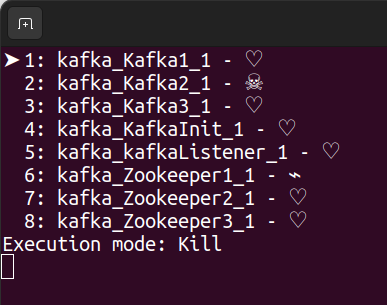

# ContainerKiller
A small tool to simulate container failures and network errors for testing distributed network settings.

Use the following shortcuts to simulate faillure:

| Key   | Result                                                                                  |
|-------|-----------------------------------------------------------------------------------------|
| 0-9   | Executes the command on the given container                                             |
| s     | Switches to 'Stop' mode resulting in a SIGINT on the running process                    |
| k     | Switches to 'Kill' mode resulting in a SIGTERM on the running process                   |
| n     | Switches to 'NetworkDown' mode which will remove the container from the default network |
| ↑     | Moves the pointer up                                                                    |
| ↓     | Moves the pointer down                                                                  |
| Space | Executes the command on the selected container                                          |

# Building
To start the project you need the dotnet core SDK 7.0 or newer.

You can get it [here](https://dotnet.microsoft.com/download)
